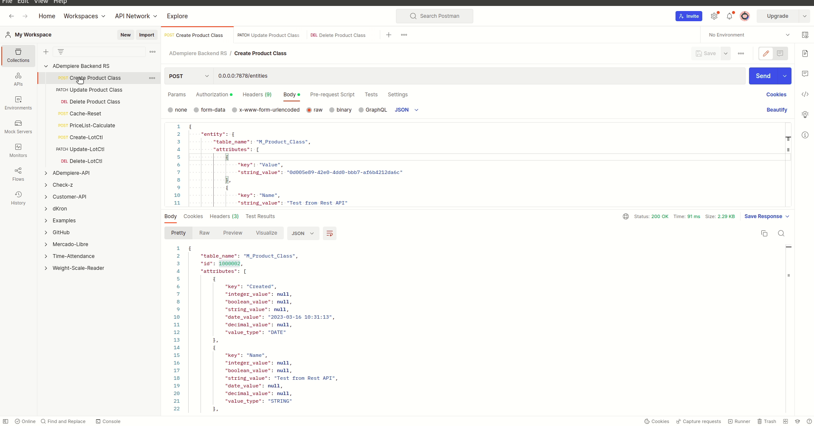

# ADempiere Backend Service from Rust
A Rest API developed with rust for ADempiere, this backend use **gRPC** for connect with **adempiere-middleware** and publish all endpoints using Rest API.

This backend was developed over [salvo.rs](https://salvo.rs/) as framework.

You are free of contribute with us for improve it.



## Requirements
- Just install [rust](https://www.rust-lang.org/tools/install) from page
- Protoc compiler [here](https://grpc.io/docs/protoc-installation/)
- [rust](https://www.rust-lang.org/)

```Shell
apt install -y protobuf-compiler
$ protoc --version  # Ensure compiler version is 3+
```

## Getting Started
This project ewas developed over [rust](https://www.rust-lang.org/) language and if you need run it just need run the follow commands

### Clone it
```Shell
git clone https://github.com/erpya/adempiere_backend_rs
```

### Go to folder
```Shell
cd adempiere_backend_rs
```

### Build Project
```Shell
cargo build
```

### Start Service
```Shell
cargo run --bin server
```

### Console Output

```Shell
2023-03-09T20:12:09.714Z INFO  [server] Server Address: "0.0.0.0:7878"
2023-03-09T20:12:09.714Z INFO  [server] └──!NULL!
    ├──entities
    │   ├──[POST] -> server::create_entity
    │   ├──[PATCH] -> server::update_entity
    │   └──[DELETE] -> server::delete_entity
    └──process
        └──[POST] -> server::run_process
```

### Deploy with docker

#### Minimal Docker Requirements
To use this Docker image you must have your Docker engine version greater than or equal to 3.0.

#### Environment variables
- `MIDDLEWARE_HOST`: Middleware host for use adempiere as gRPC server. Default `http://0.0.0.0:50059`
- `TZ`: (Time Zone) Indicates the time zone to set in the nginx-based container, the default value is `America/Caracas` (UTC -4:00).

You can download the last image from docker hub, just run the follow command:
You can build images using the follow command

```
docker build -t adempiere-backend-rs -f docker/Dockerfile .
```

After build just run it

```
docker run -d -p 7878:7878 --name adempiere-backend -e MIDDLEWARE_HOST="http://0.0.0.0:50059" openls/adempiere-backend-rs
```

See all images [here](https://hub.docker.com/r/openls/adempiere-backend-rs)

## Run with Docker Compose

You can also run it with `docker compose` for develop enviroment. Note that this is a easy way for start the service with PostgreSQL and middleware.

### Requirements

- [Docker Compose v2.16.0 or later](https://docs.docker.com/compose/install/linux/)

```Shell
docker compose version
Docker Compose version v2.16.0
```

## Run it

Just go to `docker-compose` folder and run it

```Shell
cd docker-compose
```

```Shell
docker compose up
```


### Setup a new Entity

The follow is a curl calling for create a Device

- Table Name: **M_Product_Class**
- Value: **0d005e89-42e0-4dd0-bbb7-af6b4212da6c**
- Name: **Test from Rest API**
- IsDefault: **false**
- Description: **Test**

```Shell
curl --location '0.0.0.0:7878/entities' \
--header 'Authorization: Bearer <Token>' \
--header 'Content-Type: application/json' \
--data '{
    "entity": {
        "table_name": "M_Product_Class",
        "attributes": [
            {
                "key": "Value",
                "string_value": "0d005e89-42e0-4dd0-bbb7-af6b4212da6c",
                "value_type": "STRING"
            },
            {
                "key": "Name",
                "string_value": "Test from Rest API",
                "value_type": "STRING"
            },
            {
                "key": "IsDefault",
                "boolean_value": false,
                "value_type": "BOOLEAN"
            },
            {
                "key": "Description",
                "string_value": "Test",
                "value_type": "STRING"
            }
        ]
    }
}'
```
See all endpoints [here](https://documenter.getpostman.com/view/18440575/2s93JnW7XM)
